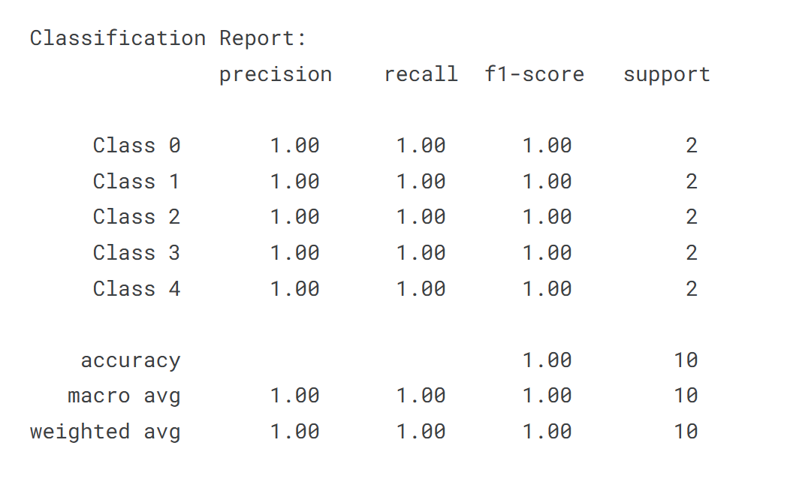

# GeoGuide: Autonomous Event-Responsive Robotic System

GeoGuide is an autonomous robotic system designed to detect and respond to critical events in simulated war zone environments. It leverages image processing and machine learning to identify high-priority events from overhead images and navigates dynamically to those locations using optimal path planning algorithms.

---

## 📌 Problem Statement

Design and develop a robotic system capable of:
- Detecting war zone events like fires, destroyed buildings, and aid zones
- Prioritizing events based on urgency
- Planning optimal paths through the environment
- Navigating autonomously to the event location
- Providing real-time geo-tracking on a digital map

---

## 🚀 Key Features

- Real-time event detection via satellite-style input images
- Event classification using ResNet-based CNN
- Optimal pathfinding based on event urgency
- Line-following autonomous robot with IR sensor guidance
- Real-time decision-making and movement control via ESP32

---

## 🧠 Technologies Used

- **ESP32 Microcontroller**
- **Convolutional Neural Network (ResNet)**
- **Image Processing (OpenCV, Python)**
- **IR Sensors for Line Detection**
- **L298N Motor Driver Module**
- **DC Motors, Chassis, Battery Pack**
- **Python, Arduino IDE, C++**

---

## 🛠️ Hardware Components

- ESP32 Dev Board  
- IR Sensors (2x)  
- L298N Motor Driver  
- DC Motors and Chassis  
- Camera Module  
- Power Supply (Battery Pack + Buck Converter)  
- Jumper Wires, Breadboard / PCB  

---

## ⚙️ How It Works

1. **Image Capture**: Overhead camera captures the map with events marked.
2. **Event Detection**: Image is processed; a ResNet-based CNN identifies and classifies events.
3. **Path Planning**: Based on event priority, the shortest path is computed.
4. **Navigation**: The robot follows black lines on a white map using IR sensors.
5. **Execution**: Bot moves autonomously to the high-priority event location.

---

## 📊 Results

The GeoGuide robot successfully detects multiple types of events and navigates accurately to their location based on priority. The system demonstrates robust AI-driven navigation and event handling in a controlled environment.

## (ResNet Model)Results :-

The ResNet-based model achieved outstanding performance in the classification task:

- **Test Accuracy**: 100.0%
- **Validation Accuracy (Epoch 9/25)**: ~83.75%
- **Loss (Epoch 9/25)**: ~0.5040

### 📈 Training Accuracy & Loss

-Results.png)

### 📊 Classification Report

---

## 🔮 Future Enhancements

- Integrating deep reinforcement learning for adaptive navigation
- Improving terrain adaptability for real-world deployment
- Expanding event classes for broader emergency detection

---

## 📚 Key Learnings

- Implementing machine learning and CNNs (YOLO, ResNet)
- Image processing and event classification
- Path planning and real-time robotic navigation

---

## 👥 Team Members

### Mentors
- Sahil  
- Akhilesh  
- Rishabh  
- Arush  
- SaiChiranthan  

### Mentees
- Himanshi Gigal  
- Suhas Gowda M  
- Prajwal 
- Vaibhav  
- Harish  

---

## 📖 References

- [Deep Residual Learning for Image Recognition (ResNet)](https://arxiv.org/pdf/1512.03385)
- [YOLOv4: Optimal Speed and Accuracy for Object Detection](https://arxiv.org/pdf/2004.10934)

---

> Developed as part of The Institution of Engineers (India), NITK Chapter Club Project
